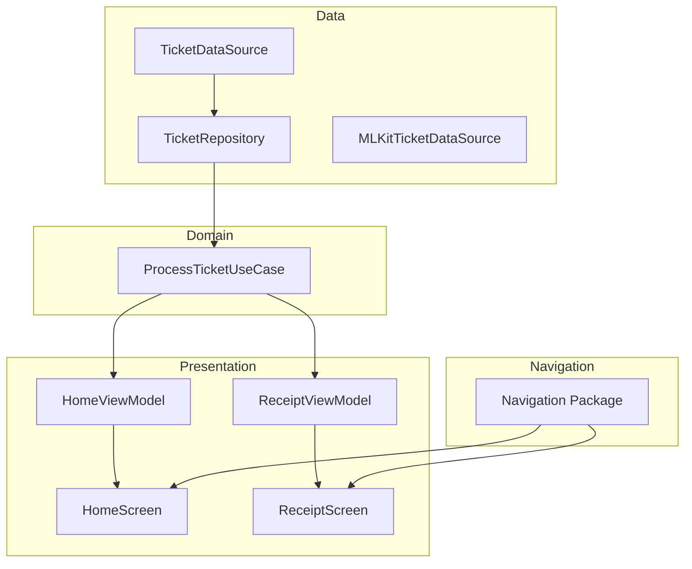

# 📱 Split Bill – Arquitectura a Prueba de Futuro

Este proyecto es parte del reto **“Tu Primera Arquitectura a Prueba de Futuro”** impartido por [Antonio Leiva](https://devexpert.io).  
El objetivo fue transformar una app caótica en una solución mantenible, escalable y fácil de testear, aplicando principios de **Clean Architecture**, **SOLID** y **MVVM con Jetpack Compose**.

---

## 🗂️ Estructura de la Arquitectura

El proyecto se organiza en **tres capas principales**:

```
app/
 ├── data/        -> Origen y gestión de datos (DataSources, Repositorios)
 ├── domain/      -> Lógica de negocio (Use Cases)
 ├── ui/          -> Presentación (ViewModels + Composables)
 └── navigation/  -> Gestión centralizada de rutas y pantallas
```

---

## 📅 Aprendizajes por Día

### 🔎 Día 1 – El Diagnóstico
- Identificamos los **code smells** en la app inicial.
- Principal problema: **mezcla de responsabilidades** (violación del **Principio de Responsabilidad Única – SRP**).
- Ejemplos:
  - `HomeScreen` hacía UI, cálculos y gestión de estado.
  - `ReceiptScreen` controlaba la cámara y además procesaba tickets.
- Conclusión: había demasiadas razones para cambiar el mismo código → difícil de mantener y escalar.

---

### 🛡️ Día 2 – La Capa que lo Cambia Todo
- Construimos la **Capa de Datos**.
- Introducción del **Patrón Repositorio** + **Patrón DataSource**:
  - `TicketDataSource` → interfaz que define cómo procesar tickets.
  - `MLKitTicketDataSource` → implementación concreta usando ML Kit.
  - `TicketRepository` → único punto de acceso para orquestar datos.
- Beneficio: separamos el *qué* de los datos del *cómo se obtienen*.

---

### 🧠 Día 3 – El Cerebro de la App
- Creamos la **Capa de Dominio**.
- Uso de **Casos de Uso (Use Cases)**:
  - Ejemplo: `ProcessTicketUseCase`.
- Características:
  - Son clases **puras de Kotlin**, sin dependencias de Android.
  - Encapsulan lógica de negocio y orquestan repositorios.
  - Testeables en milisegundos.
- Resultado: la inteligencia de la app queda aislada y reutilizable.

---

### 🎨 Día 4 – La UI Inteligente y Reactiva
- Implementamos la **Capa de Presentación** con **MVVM + UDF (Flujo de Datos Unidireccional)**.
- Introducción de `ViewModels` que:
  - Ejecutan casos de uso.
  - Exponen un único `UiState` observable.
  - Manejan eventos desde la UI.
- Refactorización:
  - `HomeScreen` y `ReceiptScreen` quedaron como **Composables “tontos”** → solo pintan estado y delegan la lógica al ViewModel.
- Beneficio: UI más predecible, fácil de testear y mantenible.

---

### 🧩 Día 5 – Uniendo las Piezas y la Prueba de Fuego
- Implementamos **Inyección de Dependencias (DI)** para conectar todas las capas.
  - Creamos un `AppModule` manual que provee DataSources, Repositorios y Use Cases.
  - La `MainActivity` quedó limpia al delegar la creación de dependencias al módulo DI.
- Introducción de **Testing profesional**:
  - Creamos un test unitario para `ProcessTicketUseCase` usando un `FakeTicketDataSource`.
  - Se validó que la lógica de negocio es **100% verificable en milisegundos**, sin necesidad de levantar la UI.
- **Más tests implementados**:
  - ✅ Tests unitarios adicionales para los distintos **UseCases**.
  - ✅ Test unitario de `HomeViewModel` utilizando **MockK** para mocks y **Robolectric** para simular el entorno Android.
  - ✅ Test de Instrumentación de Android para la pantalla `HomeScreen` (Composable de Jetpack Compose).
- **Navegación centralizada**:
  - Se añadió un paquete `navigation/` para gestionar todas las rutas de forma clara y escalable.
- Beneficio: ahora nuestra app tiene una **arquitectura profesional, cohesiva, testeable y con navegación mantenible**.

---

## 🏗️ Diagrama General



---

## ✅ Beneficios de esta Arquitectura

- **Mantenible** → cada capa tiene responsabilidades claras.
- **Testeable** → casos de uso puros de Kotlin, sin dependencias de Android + tests unitarios y de UI.
- **Escalable** → fácil añadir nuevas fuentes de datos, lógica o pantallas.
- **Predecible** → UI controlada por un único `UiState`.
- **Flexible** → navegación centralizada para evitar duplicaciones.

---

## 📚 Recursos del Reto
- [Repositorio base Split Bill](https://github.com/devexpert-io/split-bill)
- [Canal de Discord](https://devexpert.io/discord)
- [Directos en YouTube](https://youtube.com/@AntonioLeiva)

---

## 🎉 Conclusión Final del Reto
Tras 5 días de trabajo:

- Partimos de un proyecto caótico lleno de responsabilidades mezcladas.
- Fuimos separando responsabilidades en **capas claras (Data, Domain, UI)**.
- Añadimos **Use Cases** para encapsular lógica pura de negocio.
- Refactorizamos la **UI** para que sea reactiva y predecible con ViewModels y UDF.
- Añadimos un **sistema de navegación centralizado** para mejorar la mantenibilidad.
- Cerramos el ciclo con **Inyección de Dependencias y Testing avanzado** (MockK, Robolectric, Compose UI Tests), logrando una app mantenible, escalable y totalmente testeable.

Este recorrido muestra cómo aplicar **Clean Architecture en Android con Kotlin y Jetpack Compose**, creando aplicaciones robustas a prueba de futuro.

---

✍️ **Autor del Reto:** [Antonio Leiva](http://devexpert.io) – Google Developer Expert en Android  
👨‍💻 **README creado a partir de lo aprendido en el reto.**