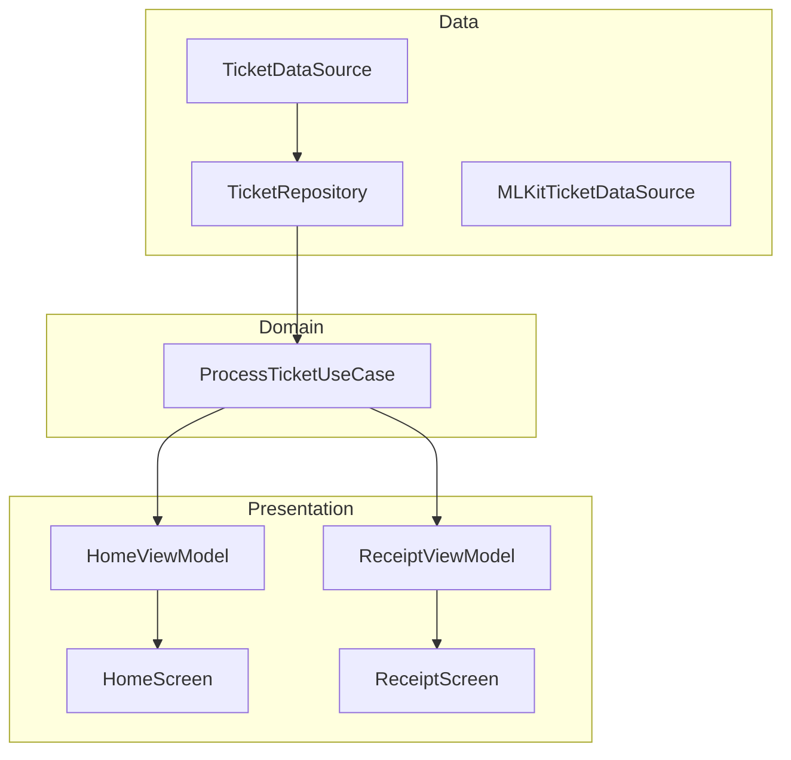

# 📱 Split Bill – Arquitectura a Prueba de Futuro

Este proyecto es parte del reto **“Tu Primera Arquitectura a Prueba de Futuro”** impartido por [Antonio Leiva](https://devexpert.io).  
El objetivo fue transformar una app caótica en una solución mantenible, escalable y fácil de testear, aplicando principios de **Clean Architecture**, **SOLID** y **MVVM con Jetpack Compose**.

---

## 🗂️ Estructura de la Arquitectura

El proyecto se organiza en **tres capas principales**:

```
app/
 ├── data/        -> Origen y gestión de datos (DataSources, Repositorios)
 ├── domain/      -> Lógica de negocio (Use Cases)
 └── ui/          -> Presentación (ViewModels + Composables)
```

---

## 📅 Aprendizajes por Día

### 🔎 Día 1 – El Diagnóstico
- Identificamos los **code smells** en la app inicial.
- Principal problema: **mezcla de responsabilidades** (violación del **Principio de Responsabilidad Única – SRP**).
- Ejemplos:
   - `HomeScreen` hacía UI, cálculos y gestión de estado.
   - `ReceiptScreen` controlaba la cámara y además procesaba tickets.
- Conclusión: había demasiadas razones para cambiar el mismo código → difícil de mantener y escalar.

---

### 🛡️ Día 2 – La Capa que lo Cambia Todo
- Construimos la **Capa de Datos**.
- Introducción del **Patrón Repositorio** + **Patrón DataSource**:
   - `TicketDataSource` → interfaz que define cómo procesar tickets.
   - `MLKitTicketDataSource` → implementación concreta usando ML Kit.
   - `TicketRepository` → único punto de acceso para orquestar datos.
- Beneficio: separamos el *qué* de los datos del *cómo se obtienen*.

---

### 🧠 Día 3 – El Cerebro de la App
- Creamos la **Capa de Dominio**.
- Uso de **Casos de Uso (Use Cases)**:
   - Ejemplo: `ProcessTicketUseCase`.
- Características:
   - Son clases **puras de Kotlin**, sin dependencias de Android.
   - Encapsulan lógica de negocio y orquestan repositorios.
   - Testeables en milisegundos.
- Resultado: la inteligencia de la app queda aislada y reutilizable.

---

### 🎨 Día 4 – La UI Inteligente y Reactiva
- Implementamos la **Capa de Presentación** con **MVVM + UDF (Flujo de Datos Unidireccional)**.
- Introducción de `ViewModels` que:
   - Ejecutan casos de uso.
   - Exponen un único `UiState` observable.
   - Manejan eventos desde la UI.
- Refactorización:
   - `HomeScreen` y `ReceiptScreen` quedaron como **Composables “tontos”** → solo pintan estado y delegan la lógica al ViewModel.
- Beneficio: UI más predecible, fácil de testear y mantenible.

---

## 🏗️ Diagrama General



---

## ✅ Beneficios de esta Arquitectura

- **Mantenible** → cada capa tiene responsabilidades claras.
- **Testeable** → casos de uso puros de Kotlin, sin dependencias de Android.
- **Escalable** → fácil añadir nuevas fuentes de datos o lógica.
- **Predecible** → UI controlada por un único `UiState`.

---

## 📚 Recursos del Reto
- [Repositorio base Split Bill](https://github.com/devexpert-io/split-bill)
- [Canal de Discord](https://devexpert.io/discord)
- [Directos en YouTube](https://youtube.com/@AntonioLeiva)

---

✍️ **Autor del Reto:** [Antonio Leiva](http://devexpert.io) – Google Developer Expert en Android
